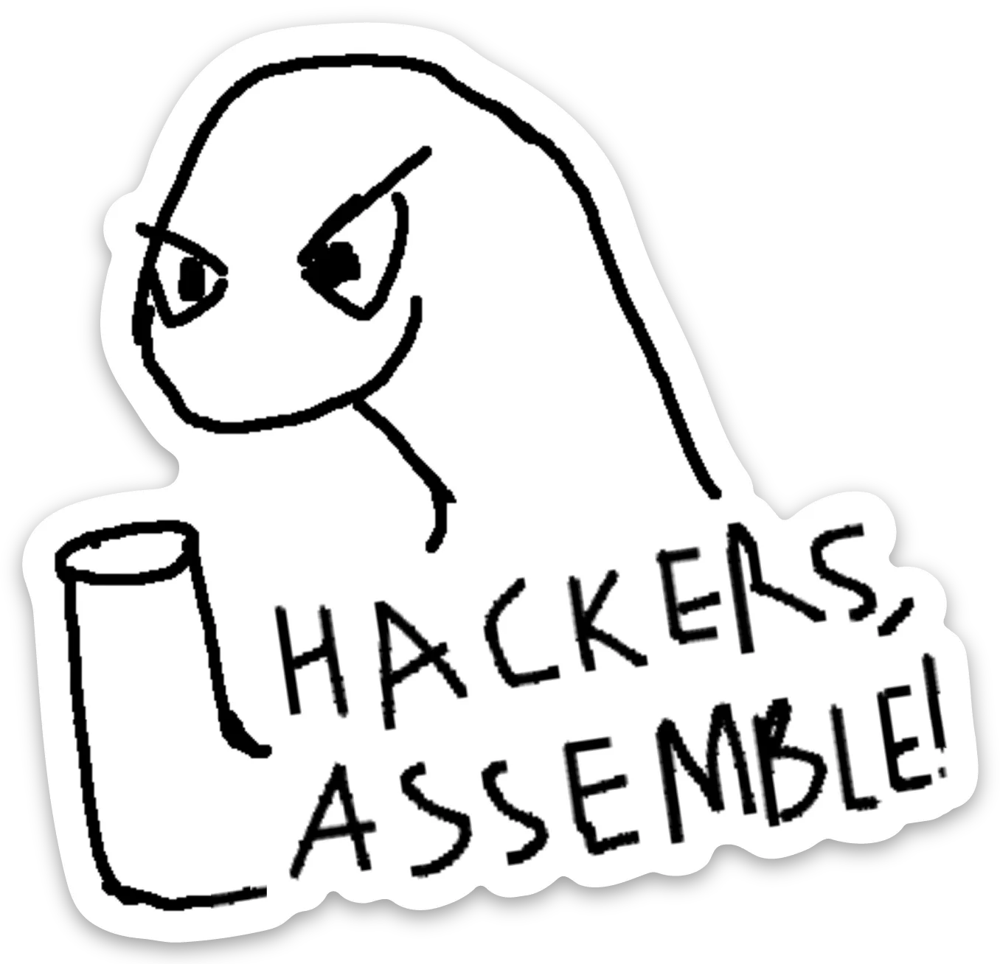

<div align="center">


# Hack Club Leaders Portal


**The dashboard club leaders actually run their club from.**
Roster, events, ships, the shop, chat — one login, one place.

[](https://git.io/typing-svg)

</div>

Every Hack Club is run by teenagers doing this on top of homework, and most of them didn't sign up to be a sysadmin. This portal is the thing that lets a leader spend five minutes on club admin instead of fifty. Sign in with your Hack Club identity, no passwords to lose, and everything a club needs — team roster, events, ships, shop, chat, settings — lives behind one login.

<div align="center">

</div>

---

## Features

- **Hack Club OAuth 2.0** — sign in via [identity.hackclub.com](https://identity.hackclub.com), no passwords required
- **Protected dashboard** — all `/dashboard/*` routes require authentication; leaders/mentors/members see different capabilities
- **Club management** — team roster, event schedule with RSVPs, workshops, shipped-project tracker, club levels, newsletter dispatches, and club settings, all backed by a JSON API with CSRF protection
- **Projects & ships** — members track projects Draft → Submitted → Shipped; shipped projects count toward club levels
- **Shop** — coin-based catalog with cart, checkout, and item requests
- **Chat** — shared club channels with message polling and per-channel unread dots
- **Club map** — every active Hack Club plotted from the official directory
- **Notifications** — in-app feed with mark-all-read
- **Hackatime integration** — coding-time stats and project linking via OAuth or user ID
- **Admin tools** — review queue for submitted projects, per-club detail, item request log
- **i18n** — 12 languages (en, es, fr, de, pt, it, ru, hi, zh, ja, ko, ar)
- **Image upload & crop** — avatar/project thumbnails with client-side crop (Vercel Blob)
- **Dark mode** — toggleable, persisted via JS, with a per-club default in settings
- **Right-click actions** — contextual shortcuts for adding, editing, submitting, RSVPing, shopping, copying links, refreshing, and switching themes
- **Skeleton loaders** — shimmer placeholders on every client-hydrated dashboard page and async card
- **Stale-while-revalidate** — client caches state in localStorage, refreshes from the API in background
- **Flash messages** — success/error feedback on auth events
- **Jinja2 templating** — `current_user` injected into every template via context processor

---

## Project Structure

```
.
├── app.py                  # Flask app factory, middleware, error handlers
├── src/                    # routes (web, api, auth, chat, club, admin), storage, helpers
│   ├── storage.py          # session / Airtable / Mongo storage backends
│   ├── storage_mongo.py
│   ├── routes_*.py
│   ├── helpers.py
│   ├── notifications.py
│   └── email.py
├── scripts/                # seed_mongo, split_i18n_data, convert_images, Airtable checks
├── templates/
│   ├── index.html          # landing page
│   ├── events.html         # public events page
│   ├── sign-in.html, join.html, welcome.html
│   ├── dashboard.html, dashboard_layout.html
│   ├── dashboard/          # team, events, workshops, ships, projects, levels, shop,
│   │                       # chat, notifications, map, tools, settings, profile,
│   │                       # admin, admin_club
│   ├── landing/            # landing page partials
│   └── partials/           # header, footer, icons, squiggle
├── static/
│   ├── css/                # base, dashboard, landing sections, skeleton, dark-mode, ...
│   ├── js/                 # dashboard.js, dashboard-chat.js, events.js, i18n, ...
│   │   └── i18n/           # per-language strings (generated by scripts/split_i18n_data.py)
│   ├── fonts/
│   └── images/             # events, hackclub-site, Stickers
├── tests/
├── docs/
├── requirements.txt
├── pyproject.toml          # ruff + mypy config
├── vercel.json
└── .env.example
```

### Context menu shortcuts

Right-click anywhere in the authenticated dashboard to open a contextual action menu. The menu adapts to the surface under the pointer:

- On an empty dashboard area: create the most relevant record for the current page, refresh data, or toggle the theme.
- On a member, event, project, workshop, or shop item: open the actions already available for that record, including edit, delete, RSVP, submit, view details, or add to cart.
- On a navigation link: open it in a new tab or copy its URL.

Actions reuse the existing modal and API flows, so role permissions and server-side authorization remain the source of truth. The menu is keyboard-dismissible with `Escape`, closes when the page scrolls or resizes, avoids interfering with form fields, and respects reduced-motion preferences.

---

## Getting Started

### 1. Clone the repo

```bash
git clone https://github.com/your-username/hackclub-leaders-portal.git
cd hackclub-leaders-portal
```

### 2. Install dependencies

```bash
pip install -r requirements.txt
```

Lint and type-check with `ruff check .` and `mypy src` (config in `pyproject.toml`); run tests with `pytest`.

### 3. Configure environment variables

Create a `.env` file in the project root (see `.env.example` for every option):

```env
SECRET_KEY=your-random-secret-key
HACKCLUB_CLIENT_ID=your-hackclub-client-id
HACKCLUB_CLIENT_SECRET=your-hackclub-client-secret
BASE_URL=http://127.0.0.1:5000
```

| Variable | Description |
|---|---|
| `SECRET_KEY` | Flask session secret — use a long random string |
| `HACKCLUB_CLIENT_ID` | OAuth client ID from Hack Club Identity |
| `HACKCLUB_CLIENT_SECRET` | OAuth client secret from Hack Club Identity |
| `BASE_URL` | Base URL of your app — used to build OAuth redirect URIs (falls back to the request host when empty) |
| `STORAGE_BACKEND` | `session` (default, cookie-based single-user), `airtable`, or `mongo` |
| `AIRTABLE_TOKEN` / `AIRTABLE_BASE_ID` | Airtable credentials (required when `STORAGE_BACKEND=airtable`) |
| `MONGODB_URI` / `MONGODB_DB` | Mongo connection (required when `STORAGE_BACKEND=mongo`) |
| `HACKATIME_CLIENT_ID` / `HACKATIME_CLIENT_SECRET` | Hackatime OAuth credentials for one-click time-tracking connect |
| `ADMIN_EMAILS` | Comma-separated admin allowlist |
| `MAIL_*` | SMTP settings for transactional email (RSVP, project submissions) |
| `BLOB_READ_WRITE_TOKEN` | Vercel Blob token for image uploads |
| `FLASK_DEBUG` / `PLAYTEST_ENABLED` | Dev-only toggles |

To get OAuth credentials, register your app at [identity.hackclub.com](https://identity.hackclub.com). Set the redirect URI to `{BASE_URL}/auth/hackclub/callback`.

### 4. Run the app

```bash
python app.py
```

The app will be available at [http://127.0.0.1:5000](http://127.0.0.1:5000).

---

## Routes

### Pages

| Route | Auth required | Description |
|---|---|---|
| `/` | No | Home / landing page |
| `/events` | No | Public events page |
| `/sign-in` | No | Sign-in page |
| `/join/<code>` | No | Club join link |
| `/dashboard` | Yes | Club home |
| `/dashboard/team` | Yes | Team roster management |
| `/dashboard/events` | Yes | Events management |
| `/dashboard/workshops` | Yes | Workshop proposals & scheduling |
| `/dashboard/ships` | Yes | Shipped-project tracker |
| `/dashboard/projects` | Yes | Projects, drafts, submissions, Hackatime stats |
| `/dashboard/levels` | Yes | Club level progression |
| `/dashboard/shop` | Yes (leader) | Shop & cart |
| `/dashboard/chat` | Yes | Club chat channels |
| `/dashboard/notifications` | Yes | Notifications & newsletters |
| `/dashboard/map` | Yes | Club map |
| `/dashboard/tools` | Yes (leader) | Leader tools & resources |
| `/dashboard/settings` | Yes (leader) | Club settings |
| `/dashboard/profile` | Yes | Personal profile |
| `/dashboard/welcome` | Yes | Join-or-create-club gate |
| `/dashboard/admin` | Admin only | Admin overview + review queue |
| `/dashboard/admin/club/<club_key>` | Admin only | Per-club admin detail |
| `/auth/hackclub` | No | Starts OAuth flow |
| `/auth/hackclub/callback` | No | OAuth callback |
| `/auth/hackatime` | Yes | Hackatime OAuth connect |

Note: `/dashboard/newsletters` 301-redirects to `/dashboard/notifications`.

### JSON API

All under `/api/dashboard/`: state (section-scoped `GET /state?sections=`), team/events/workshops/cart/checkout/item-requests/projects CRUD, notifications, settings/profile/join-code updates, hackatime stats/projects, image upload, and `/api/dashboard/chat/*` (channels + messages). Mutations require CSRF tokens; role checks enforced server-side.

---

## OAuth Flow

```
User clicks "Sign in with Hack Club"
    → /auth/hackclub
    → identity.hackclub.com/oauth/authorize  (user approves)
    → /auth/hackclub/callback
    → exchange code for access token
    → fetch user profile from /oauth/userinfo
    → store in session['user']
    → redirect to /dashboard
```

CSRF is prevented using a `state` parameter stored in the session and verified on callback.

---

## Performance notes

- **Storage caching** — Airtable loads are memoized per club for 10s (`AirtableStorage._load_cache`), so a page + state + notifications burst collapses into one round-trip; `save()` invalidates immediately.
- **WebP pipeline** — `scripts/convert_images.py` converts heavyweight event/sticker images to WebP and rewrites `static/js/events-data.js` refs; originals are kept.
- **Lazy backgrounds** — event cards defer `background-image` until scrolled near the viewport (IntersectionObserver).
- **Section-scoped state** — each page fetches only the state sections it renders.

---

## Deployment (Vercel)

The repo is set up for Vercel: `vercel.json` builds `app.py` with `@vercel/python` and serves `static/` from the CDN.

1. Import the repo at [vercel.com/new](https://vercel.com/new) (or run `npx vercel`).
2. In **Project Settings → Environment Variables**, set:

| Variable | Value |
|---|---|
| `SECRET_KEY` | A long random string — **required**: without it each serverless instance generates its own key and sessions/CSRF break randomly |
| `HACKCLUB_CLIENT_ID` | OAuth client ID from Hack Club Identity |
| `HACKCLUB_CLIENT_SECRET` | OAuth client secret |
| `BASE_URL` | Your production URL, e.g. `https://your-app.vercel.app` (no trailing slash) |
| `STORAGE_BACKEND` | `airtable` or `mongo` for shared multi-user state |

3. Register `{BASE_URL}/auth/hackclub/callback` as the redirect URI at [identity.hackclub.com](https://identity.hackclub.com).

Preview deployments work without `BASE_URL` (the app falls back to the request host via `ProxyFix`), but sign-in only succeeds on hosts whose callback URL is registered with Hack Club Identity.

Deploying elsewhere (Railway, Render, a VPS) needs no config changes — just the same environment variables.

---

## License

MIT — go run a club with it.

<div align="center">
<sub>made by hack clubbers, for hack clubbers</sub><br>

</div>
